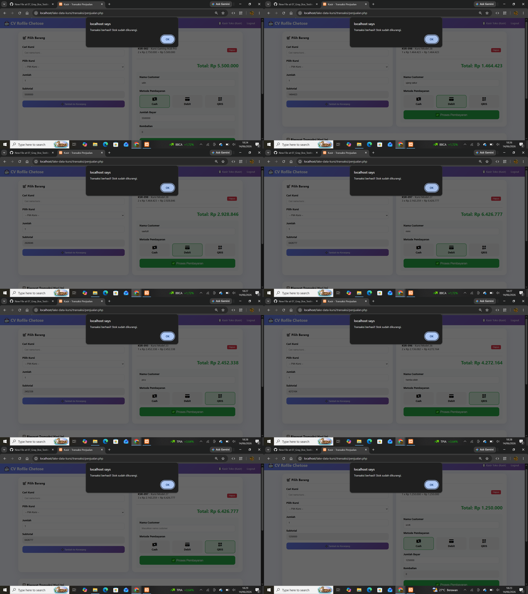

# Orthogonal Array Testing (OAT)

## Tujuan
Menguji kombinasi parameter dengan jumlah test case minimal.

## Studi Kasus
Transaksi Penjualan (Metode Pembayaran & Jumlah Item)

## Faktor dan Level
| Faktor | Level 1 | Level 2 | Level 3 |
|--------|---------|---------|---------|
| Metode Pembayaran | Cash | Debit | QRIS |
| Jumlah Item | 1 item | 2 item | 3 item |
| Stok Tersedia | Cukup | Cukup | Cukup |

## Perhitungan
- Jumlah Faktor = 3
- Jumlah Level = 3
- Tipe Array = L9 (3³) → **9 test case**

## Tabel OAT (Kasus Uji)
| Test Case | Metode | Jumlah Item | Expected Result | Status |
|-----------|--------|-------------|-----------------|--------|
| TC-OAT-01 | Cash | 1 item | ✅ Sukses | ✅ Pass |
| TC-OAT-02 | Cash | 2 item | ✅ Sukses | ✅ Pass |
| TC-OAT-03 | Cash | 3 item | ✅ Sukses | ✅ Pass |
| TC-OAT-04 | Debit | 1 item | ✅ Sukses | ✅ Pass |
| TC-OAT-05 | Debit | 2 item | ✅ Sukses | ✅ Pass |
| TC-OAT-06 | Debit | 3 item | ✅ Sukses | ✅ Pass |
| TC-OAT-07 | QRIS | 1 item | ✅ Sukses | ✅ Pass |
| TC-OAT-08 | QRIS | 2 item | ✅ Sukses | ✅ Pass |
| TC-OAT-09 | QRIS | 3 item | ✅ Sukses | ✅ Pass |

## Kesimpulan
✅ Dengan 9 test case, semua kombinasi metode pembayaran dan jumlah item teruji.
## lampiran

