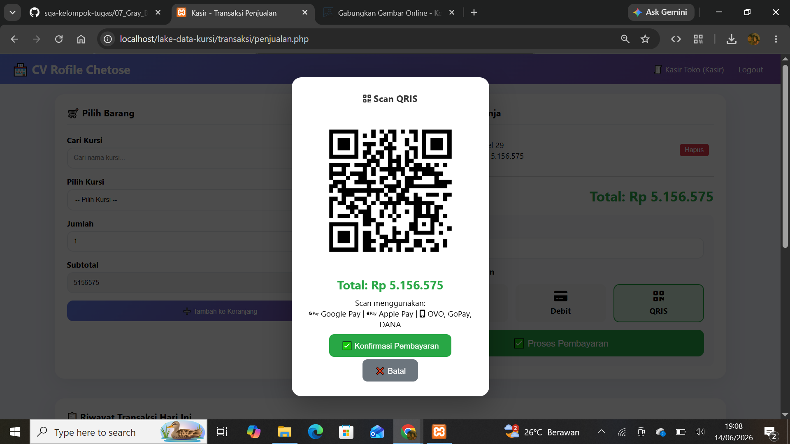

# Regression Testing

## Tujuan
Memastikan perubahan kode tidak merusak fungsionalitas lama.

## Skenario
Menambah Fitur Baru (Metode Pembayaran QRIS)

## Langkah Pengujian
| Langkah | Aktivitas | Hasil |
|---------|-----------|-------|
| 1 | Jalankan test case fungsionalitas dasar (Cash, Debit) | ✅ Lulus |
| 2 | Uji fitur baru QRIS secara menyeluruh | ✅ QR Code muncul, transaksi sukses |
| 3 | Periksa apakah fitur QRIS mempengaruhi Cash/Debit | ✅ Tidak ada dampak |
| 4 | Uji transaksi dengan 3 metode bergantian | ✅ Semua berfungsi |

## Kesimpulan
✅ Fitur QRIS berhasil ditambahkan tanpa merusak fungsionalitas Cash dan Debit.
## lampiran 

