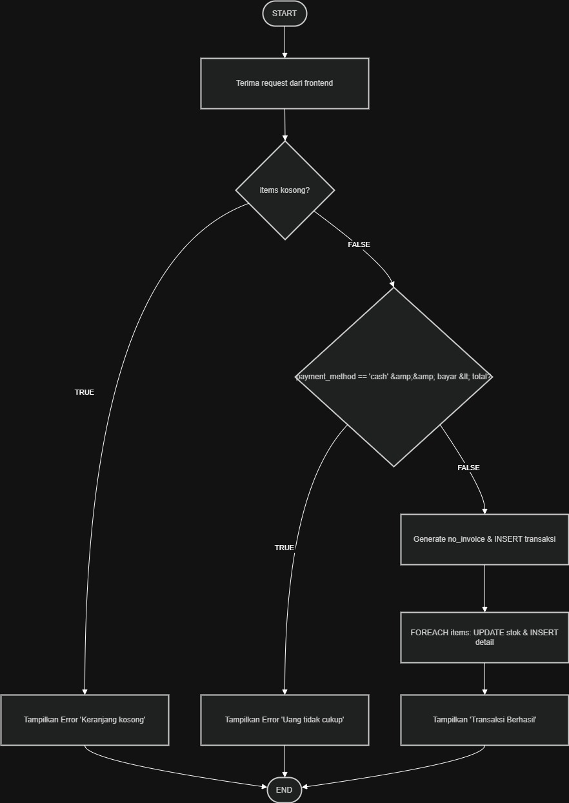
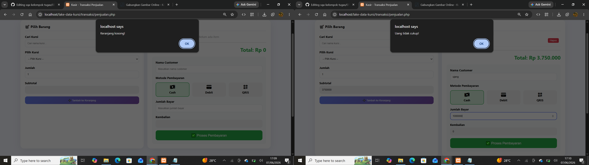
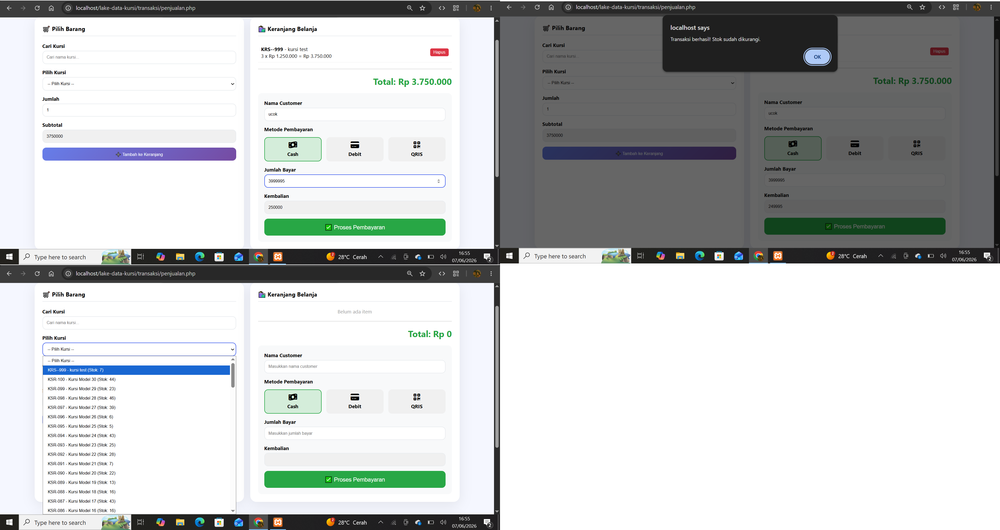

# Control Flow Testing – CV Rofile Chetose

## Informasi Umum

| Item | Keterangan |
|------|-------------|
| Metode Pengujian | White Box Testing – Control Flow Testing |
| Modul yang Diuji | Transaksi Penjualan (`proses_transaksi.php`) |
| Tanggal Pengujian | 7 Juni 2026 |
| Penguji | SQ Tester |

---

## Flowchart Control Flow

---

## Jalur Eksekusi yang Diuji

| No | Jalur | Kondisi | Expected Result | Status |
|----|-------|---------|-----------------|--------|
| 1 | START → items kosong? (TRUE) → Error "Keranjang kosong" → END | items = [] | ❌ Error: Keranjang kosong | ✅ Pass |
| 2 | START → items kosong? (FALSE) → metode cash & bayar < total? (TRUE) → Error "Uang tidak cukup" → END | metode=cash, bayar=1jt, total=1.25jt | ❌ Error: Uang tidak cukup | ✅ Pass |
| 3 | START → items kosong? (FALSE) → metode cash & bayar < total? (FALSE) → Generate no_invoice → INSERT transaksi → UPDATE stok → Tampilkan sukses → END | items ada, bayar cukup | ✅ Transaksi berhasil | ✅ Pass |

---

## Matriks Keputusan (Decision Matrix)

| Kondisi 1 | Kondisi 2 | Aksi |
|-----------|-----------|------|
| items kosong? = TRUE | - | Tampilkan error "Keranjang kosong" |
| items kosong? = FALSE | metode cash & bayar < total? = TRUE | Tampilkan error "Uang tidak cukup" |
| items kosong? = FALSE | metode cash & bayar < total? = FALSE | Proses transaksi & update stok |

---

## Hasil Pengujian Control Flow

| No | Skenario | Input | Expected Output | Actual Output | Status |
|----|----------|-------|-----------------|---------------|--------|
| 1 | Keranjang kosong | items = [] | Error "Keranjang kosong" | Error "Keranjang kosong" | ✅ Pass |
| 2 | Pembayaran Cash kurang | items ada, cash, bayar=1jt, total=1.25jt | Error "Uang tidak cukup" | Error "Uang tidak cukup" | ✅ Pass |
| 3 | Transaksi Cash valid | items ada, cash, bayar=1.5jt, total=1.25jt | Sukses, stok berkurang | Sukses, stok=9 | ✅ Pass |
| 4 | Transaksi Debit valid | items ada, debit | Sukses, alert tap kartu | Sukses, alert tap kartu | ✅ Pass |
| 5 | Transaksi QRIS valid | items ada, qris | Sukses, QR Code muncul | Sukses, QR Code muncul | ✅ Pass |

---

## Kesimpulan

| Aspek | Status |
|-------|--------|
| Tidak ada infinite loop | ✅ |
| Semua percabangan IF-ELSE berfungsi | ✅ |
| Jalur error (keranjang kosong) | ✅ |
| Jalur error (bayar kurang) | ✅ |
| Jalur sukses (transaksi valid) | ✅ |

**Status Akhir:** ✅ **Lulus (Pass) – Semua jalur kontrol berfungsi dengan baik**

---

## Lampiran

**Gambar 1 transaksi invalid**

**Gambar 2 taransakasi valid**

- **File yang diuji:** `proses_transaksi.php`
- **Lokasi:** `src/proses_transaksi.php`
