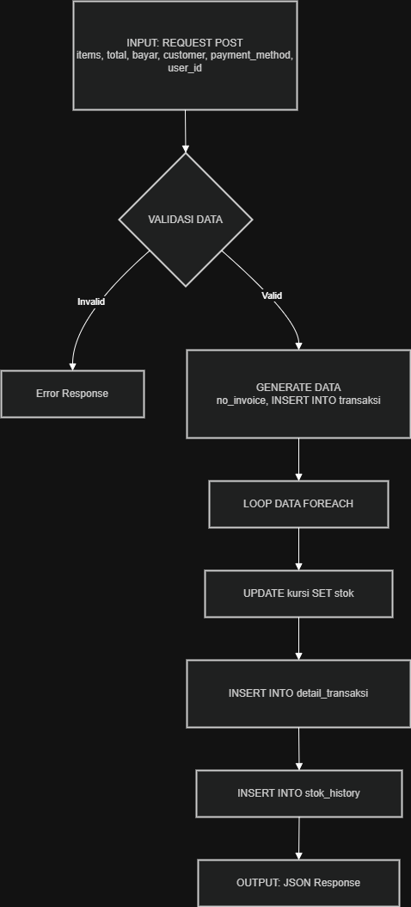

# Data Flow Testing – CV Rofile Chetose

## Informasi Umum

| Item | Keterangan |
|------|-------------|
| Metode Pengujian | White Box Testing – Data Flow Testing |
| Modul yang Diuji | Transaksi Penjualan (`proses_transaksi.php`) |
| Tanggal Pengujian | 7 Juni 2026 |
| Penguji | SQ Tester |

---

## Diagram Aliran Data

---

## Definisi Data Flow (Def, Use, Kill)

| No | Variabel | Definisi (Def) | Penggunaan (Use) | Penghapusan (Kill) | Status |
|----|----------|----------------|------------------|---------------------|--------|
| 1 | `$items` | Diterima dari POST | Validasi kosong, loop FOREACH | Setelah loop selesai | ✅ |
| 2 | `$total` | Diterima dari POST | Validasi `$bayar < $total` | Setelah validasi | ✅ |
| 3 | `$bayar` | Diterima dari POST | Validasi cash | Setelah validasi | ✅ |
| 4 | `$customer` | Diterima dari POST | INSERT transaksi | Setelah INSERT | ✅ |
| 5 | `$payment_method` | Diterima dari POST | Percabangan IF cash | Setelah percabangan | ✅ |
| 6 | `$user_id` | Diterima dari POST (session) | INSERT transaksi, INSERT stok_history | Setelah INSERT | ✅ |
| 7 | `$no_invoice` | Generate dari date+rand | INSERT transaksi, INSERT stok_history | Setelah INSERT | ✅ |
| 8 | `$transaksi_id` | Hasil `mysqli_insert_id()` | INSERT detail_transaksi | Setelah INSERT | ✅ |
| 9 | `$kursi_id` | Loop dari `$item['id']` | UPDATE stok, INSERT detail, INSERT history | Setiap iterasi loop | ✅ |
| 10 | `$jumlah` | Loop dari `$item['jumlah']` | UPDATE stok, INSERT detail, INSERT history | Setiap iterasi loop | ✅ |

---

## Skenario Data Flow

| No | Skenario | Data yang Mengalir | Expected Result | Status |
|----|----------|---------------------|-----------------|--------|
| 1 | Keranjang kosong | `$items = []` → validasi → error | Error ditampilkan, tidak ada data ke DB | ✅ Pass |
| 2 | Pembayaran cash kurang | `$bayar` < `$total` → validasi → error | Error ditampilkan, tidak ada INSERT | ✅ Pass |
| 3 | Transaksi 1 item | `$items` berisi 1 data → loop 1x → UPDATE & INSERT | Stok berkurang, detail tersimpan | ✅ Pass |
| 4 | Transaksi 2 item | `$items` berisi 2 data → loop 2x → UPDATE & INSERT | Stok berkurang 2x, detail 2 baris | ✅ Pass |
| 5 | Transaksi Debit | `$payment_method = 'debit'` → bypass validasi cash | Transaksi sukses, stok berkurang | ✅ Pass |
| 6 | Transaksi QRIS | `$payment_method = 'qris'` → bypass validasi cash | QR Code muncul, transaksi sukses | ✅ Pass |

---

## Anomali Data Flow (Yang Diperiksa)

| No | Jenis Anomali | Ada? | Keterangan |
|----|---------------|------|-------------|
| 1 | Definisi tanpa penggunaan | ❌ Tidak | Semua variabel terpakai |
| 2 | Penggunaan tanpa definisi | ❌ Tidak | Semua variabel terdefinisi |
| 3 | Variabel mati (tidak di-kill) | ❌ Tidak | Semua variabel terhapus setelah digunakan |

---

## Kesimpulan

| Aspek | Status |
|-------|--------|
| Definisi variabel | ✅ Semua terdefinisi dengan benar |
| Penggunaan variabel | ✅ Semua terpakai |
| Penghapusan variabel | ✅ Setelah digunakan |
| Tidak ada anomali data flow | ✅ |

**Status Akhir:** ✅ **Lulus (Pass) – Semua aliran data berfungsi dengan baik**

---

## Lampiran

- **File yang diuji:** `proses_transaksi.php`
- **Lokasi:** `src/proses_transaksi.php`
