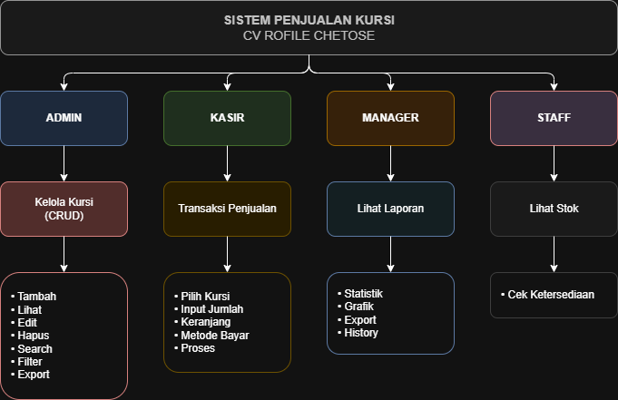

# Basic Path Testing & Cyclomatic Complexity – CV Rofile Chetose

## Informasi Umum

| Item | Keterangan |
|------|-------------|
| Metode Pengujian | White Box Testing – Basic Path Testing |
| Modul yang Diuji | Transaksi Penjualan (`proses_transaksi.php`) |
| Tanggal Pengujian | 7 Juni 2026 |
| Penguji | SQ Tester |

---

## Flow Graph

Berdasarkan pseudocode transaksi penjualan, berikut adalah Flow Graph yang merepresentasikan alur kontrol program:

---

## Elemen Flow Graph

| Elemen | Jumlah | Keterangan |
|--------|--------|-------------|
| Node (N) | 10 | Jumlah simpul dalam graf |
| Edge (E) | 12 | Jumlah garis penghubung antar node |
| Predicate Node (P) | 2 | Node 2 dan Node 4 (percabangan IF) |
| Komponen Terhubung | 1 | Satu graf utuh |

---

## Perhitungan Cyclomatic Complexity V(G)

### Rumus 1: V(G) = E - N + 2P

| Variabel | Nilai |
|----------|-------|
| E (Edge) | 12 |
| N (Node) | 10 |
| P (Komponen) | 1 |

**Perhitungan:**
V(G) = 12 - 10 + (2 × 1)
V(G) = 2 + 2
V(G) = 4

### Rumus 3: Jumlah Region (Area Tertutup)

| Region | Keterangan |
|--------|-------------|
| Region 1 | Area dalam loop FOREACH |
| Region 2 | Area setelah percabangan |
| Region 3 | Area error handling |
| Region 4 | Area luar graf |

**Hasil:** V(G) = 4 region

---

## Hasil Perhitungan

| Metode | Hasil V(G) |
|--------|------------|
| E - N + 2P | 4 |
| P + 1 | 4 |
| Jumlah Region | 4 |

**Kesimpulan:** V(G) = 4

---

## Independent Path (4 Jalur)

| Path | Rute Node | Skenario | Expected Result |
|------|-----------|----------|-----------------|
| **Path 1** | 1 → 2 → 3 → 10 | Keranjang kosong (items = []) | ❌ Error: Keranjang kosong |
| **Path 2** | 1 → 2 → 4 → 5 → 10 | Pembayaran Cash kurang (bayar < total) | ❌ Error: Uang tidak cukup |
| **Path 3** | 1 → 2 → 4 → 6 → 7 → 8 → 9 → 10 | Transaksi 1 item (loop 1x) | ✅ Sukses, stok berkurang |
| **Path 4** | 1 → 2 → 4 → 6 → 7 → 8 → 7 → 8 → 9 → 10 | Transaksi 2 item (loop 2x) | ✅ Sukses, stok berkurang 2x |

---

## Test Case untuk Independent Path

| Test ID | Path | Skenario | Input Data | Expected Result | Status |
|---------|------|----------|------------|-----------------|--------|
| TC-BP-01 | Path 1 | Keranjang kosong | items = [] | ❌ Error: Keranjang kosong | ☐ |
| TC-BP-02 | Path 2 | Pembayaran Cash kurang | cash, bayar=1jt, total=1.25jt | ❌ Error: Uang tidak cukup | ☐ |
| TC-BP-03 | Path 3 | Transaksi 1 item | 1 item, cash, bayar cukup | ✅ Sukses, stok=9 | ☐ |
| TC-BP-04 | Path 4 | Transaksi 2 item | 2 item, debit | ✅ Sukses, stok=8 | ☐ |

---

## Hasil Eksekusi Test Case

| Test ID | Skenario | Expected Result | Actual Result | Status |
|---------|----------|-----------------|---------------|--------|
| TC-BP-01 | Keranjang kosong | Error: Keranjang kosong | Error: Keranjang kosong | ✅ Pass |
| TC-BP-02 | Bayar Cash kurang | Error: Uang tidak cukup | Error: Uang tidak cukup | ✅ Pass |
| TC-BP-03 | Transaksi 1 item | Sukses, stok berkurang | Sukses, stok=9 | ✅ Pass |
| TC-BP-04 | Transaksi 2 item | Sukses, stok berkurang | Sukses, stok=7 | ✅ Pass |

---

## Kesimpulan

| Aspek | Hasil |
|-------|-------|
| Nilai Cyclomatic Complexity V(G) | 4 |
| Jumlah Independent Path | 4 path |
| Status eksekusi test case | 4/4 Pass |
| Branch Coverage | 100% |
| Statement Coverage | 100% |

**Status Akhir:** ✅ **Lulus (Pass) – Semua jalur independen telah diuji**

---

## Lampiran

- **File yang diuji:** `proses_transaksi.php`
- **Lokasi:** `src/proses_transaksi.php`
