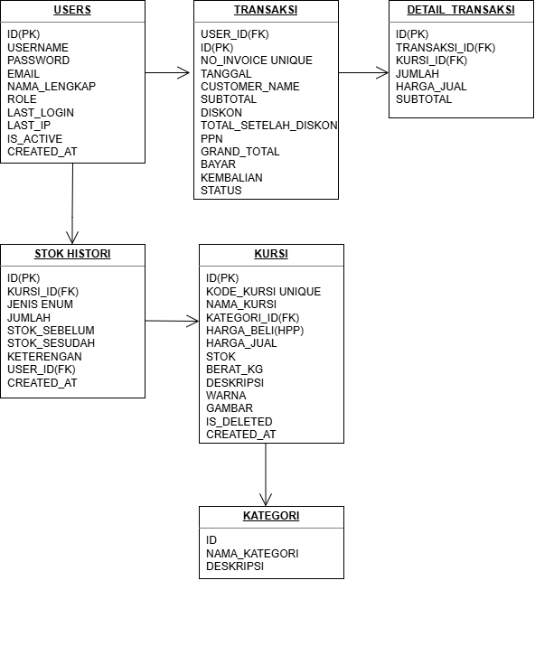
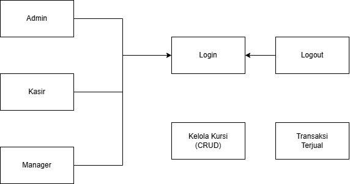
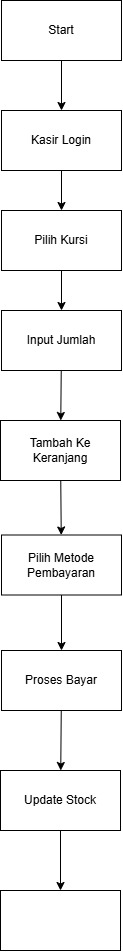
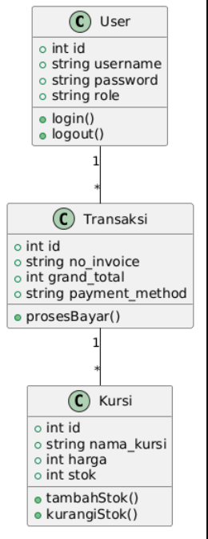
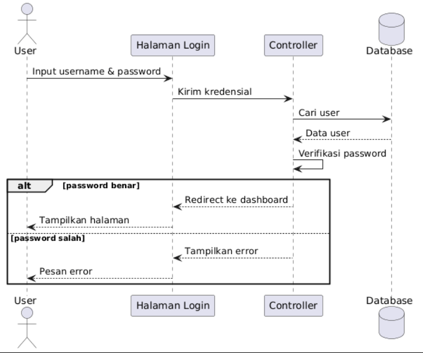

# Software Design Documentation (SDD)
## CV Rofile Chetose - Sistem Penjualan Kursi

---

## DAFTAR ISI

1. Entity Relationship Diagram (ERD)
2. Use Case Diagram
3. Activity Diagram
4. Class Diagram
5. Sequence Diagram
6. UI Mockup

---

## BAB 1: ENTITY RELATIONSHIP DIAGRAM (ERD)

*Gambar 1. ERD Sistem Penjualan Kursi CV Rofile Chetose*

---

## BAB 2: USE CASE DIAGRAM

*Gambar 2. Use Case Diagram dengan 4 role (Admin, Manager, Kasir, Staff)*

---

## BAB 3: ACTIVITY DIAGRAM (Transaksi Penjualan)

*Gambar 3. Activity Diagram Transaksi Cash, Debit, dan QRIS*

---

## BAB 4: CLASS DIAGRAM

*Gambar 4. Class Diagram User, Kursi, Transaksi, DetailTransaksi*

---

## BAB 5: SEQUENCE DIAGRAM

### Sequence Diagram Login

---

## BAB 6: UI MOCKUP

### 6.1 Halaman Login
- Form input username dan password
- Tombol login

### 6.2 Dashboard Admin
- Tabel daftar kursi
- Tombol Tambah, Edit, Hapus
- Pencarian dan filter kategori

### 6.3 Halaman Kasir
- Daftar kursi yang tersedia
- Keranjang belanja
- Pilihan metode bayar (Cash, Debit, QRIS)

### 6.4 Dashboard Manager
- Grafik penjualan (line chart)
- Filter periode (hari/minggu/bulan)
- Tombol export Excel dan PDF

### 6.5 Halaman Staff
- Tabel stok kursi (read only)
- Pencarian kursi

---

## BAB 7: KOMPONEN TEKNOLOGI

| Komponen | Teknologi |
|----------|-----------|
| Backend | PHP 8.2 |
| Database | MySQL 8.0 |
| Frontend | Bootstrap 5 |
| API | REST API |

---

**Dokumen ini bersumber dari SKPL CV Rofile Chetose**
